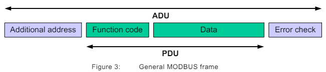
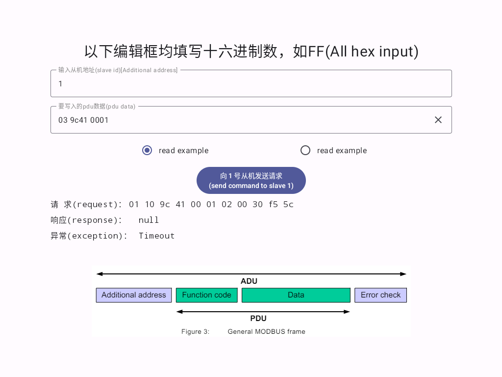

[](https://central.sonatype.com/artifact/io.github.jeadyx.modbus/simple-modbus-master)
Simple Modbus Master for Android  
---
This is a simple Modbus Master for Android. It can be used to read and write data to a Modbus slave.  

# 一、Description  
## 1. implementation  
* kotlin-dsl  
`build.gradle.kts`  
```kotlin
implementation("org.github.jeadyx.modbus:simple-modbus-master:1.3")
```

* groovy dsl  
`build.gradle`  
```groovy
implementation 'org.github.jeadyx.modbus:simple-modbus-master:1.3'
```

* version catalog  
`libs.version.toml`  
```text
[libraries]
modbus-master = "org.github.jeadyx.modbus:simple-modbus-master:1.3"
```
`build.gradle.kts`  
```kotlin
implementation(libs.modbus.master)
```

## 2. common usage  
Sample file: [SimpleModbusSample.kt](app/src/main/java/com/jeady/simplemodbusmaster/ui/modbus/SimpleModbusSample.kt)  
1. init ModbusMaster instance  
```kotlin
val simpleModbus = SimpleModbus("/dev/ttyS1", 9600)
```

2. create request  
```kotlin
val requestWrite = SimpleModbus.createCustomWriteRequest(0x10, ModbusFunctionCode.WriteMultipleRegisters.value, 0x1F00, ShortArray(2).apply { fill(0xffff.toShort()) })
val requestRead = SimpleModbus.createCustomReadRequest(0x10, ModbusFunctionCode.ReadHoldingRegisters.value, 0x1F00, 2)
```

3. send request and get response  
```kotlin
simpleModbus.write(request) { res ->
    Log.d(TAG, "Modbus: response $res")
    if (res.err!= SimpleModbusExceptionCode.NoError) {
        // response error
    } else {
        // get response
    }
}
```

## 3. pdu usage  
You can send modbus command according to the modbus pdu.

```kotlin
simpleModbus.write(SimpleModbus.createRequestFromPduString(0x10, "101f0000020001000F")){ res->
    Log.d(TAG, "ModbusPdu: response $res")
    if (res.err!= SimpleModbusExceptionCode.NoError) {
        // response error
    } else {
        // get response
    }
}
```

# 二、 sample app
This sample is based on jetpack compose.


# 三、Donate
If you like this project, please donate me.

